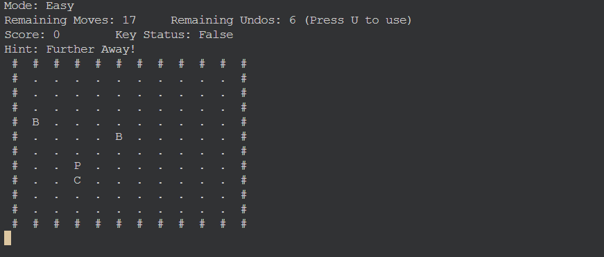
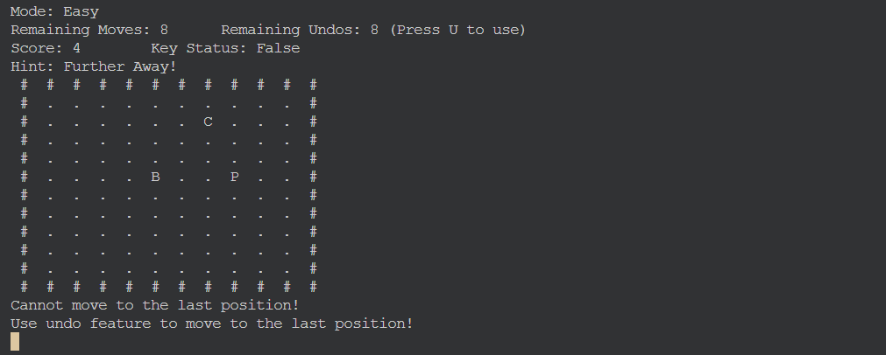
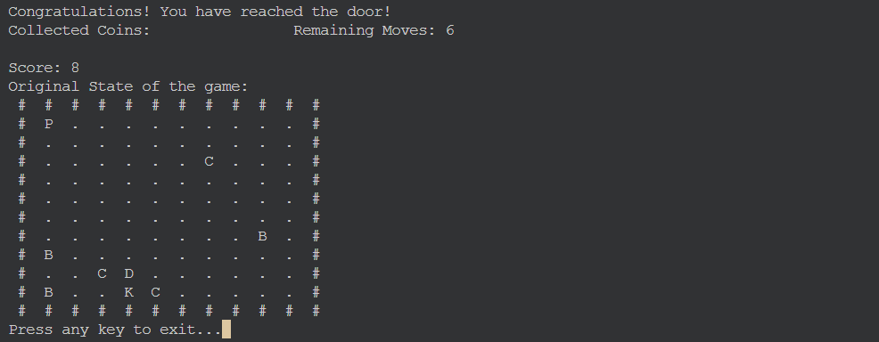
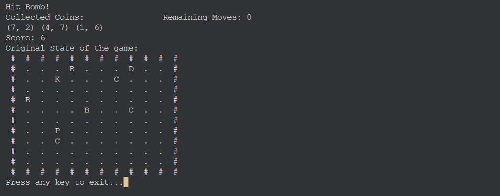

## Maze Game

### Description
This is a terminal-based maze game where the player explores a maze with limited visibility, adding a fog-of-war effect. The player can move around the maze using the arrow keys and can only see a few tiles around their current position. The goal is to explore the maze while avoiding traps, solving puzzles, and potentially reaching an exit.



### Features
- **Fog of War**: The player can only see tiles within a certain radius, making the game more mysterious and immersive.
- **Maze Exploration**: Navigate through the maze by avoiding walls (`#`) and discovering new areas.
- **Player Movement**: Move the player using `WASD` keys, with real-time updates to visibility.
- **Undo Feature**: You can use undo feature to undo your last move, if you think you are stuck. The number of undo moves is limited.
- **Coins Collection**: Coins spawn at different locations in the maze. Collect them to increase your score and number of undo move by one.
- **Bomb Traps**: Bombs spawn at different locations in the maze. Stepping on them will cause you to lose the game.

### Controls
- `w` - Move Up
- `s` - Move Down
- `a` - Move Left
- `d` - Move Right
- `u` - Undo Last Move



### Requirements
- **ncurses**: This game is built using the `ncurses` library for terminal handling and UI.
  
  You can install `ncurses` with the following:
  ```bash
  sudo apt-get install libncurses5-dev libncursesw5-dev
  ```

### Installation & Setup
1. **Clone the repository**:
   ```bash
   git clone https://github.com/Rayan581/Assignment-2.git
   cd Assignment-2
   ```

2. **Compile the game**:
   Make sure you have `ncurses` installed. Then, compile the game with `g++`:
   ```bash
   g++ -o maze_game main.cpp -lncurses
   ```

3. **Run the game**:
   ```bash
   ./maze_game
   ```

### How to Play
- After starting the game, the player (`P`) will spawn in the maze.


- Use the `WASD` keys to move around the maze.
- The area around the player will be visible, while the rest of the maze is hidden.
- Explore the maze and uncover hidden paths. Find a key to the exit door and escape through the door within given number moves.


- Collect the coins in the maze to increase your score and number of undo moves.
- There are bombs scattered in the maze. Avoid them or touching them will cause you to lose the game.


---

### Example Output

```
Mode: Easy
Remaining Moves: 17     Remaining Undos: 6 (Press U to use)
Score: 0        Key Status: False
Hint: Getting Closer!
 #  #  #  #  #  #  #  #  #  #  #  #
 #  .  .  .  .  .  .  .  .  .  .  #
 #  .  .  .  .  .  .  .  .  .  .  #
 #  .  .  .  .  .  .  .  .  .  .  #
 #  .  .  .  .  .  .  B  .  .  .  #
 #  .  C  .  P  .  .  .  .  .  .  #
 #  .  .  .  .  .  .  .  .  .  .  #
 #  .  .  .  .  .  .  .  .  .  .  #
 #  .  .  .  .  .  .  .  .  .  .  #
 #  .  .  .  .  .  .  .  .  .  .  #
 #  .  .  .  .  .  .  .  .  .  .  #
 #  #  #  #  #  #  #  #  #  #  #  #
```